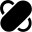
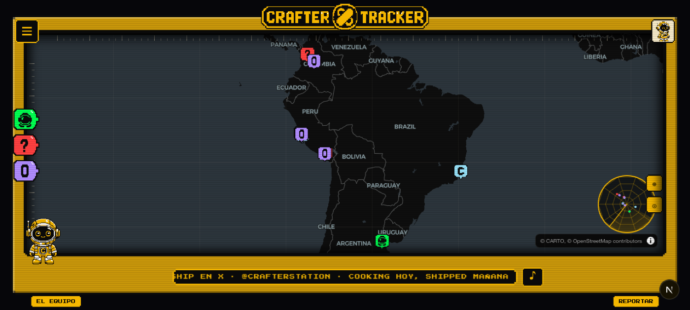
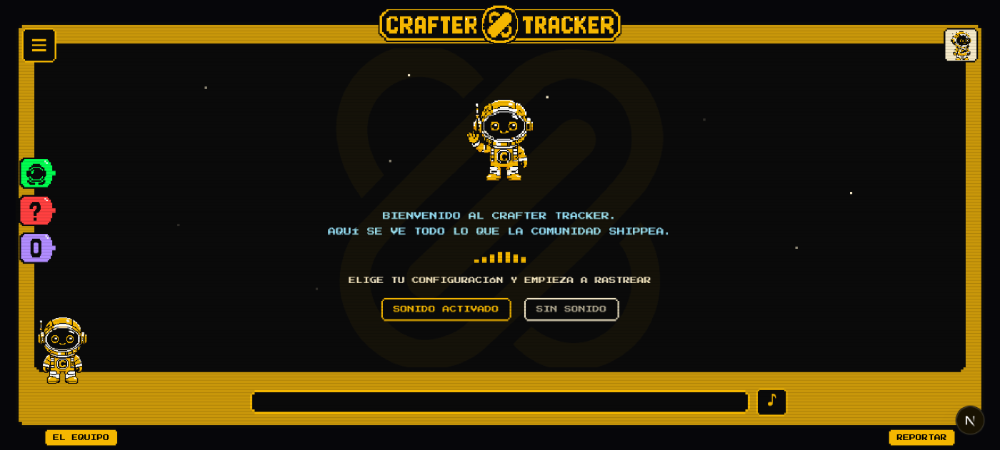

<div align="center">
  

  <h1>Crafter Tracker</h1>

  <p><strong>Cooking hoy, shipped mañana.</strong></p>

  <p>
    Mapa 8-bit en vivo de los ships, cooking sessions y eventos de la comunidad
    <a href="https://crafterstation.com">Crafter Station</a> en LATAM y más allá.
  </p>

  <p>
    <a href="LICENSE"></a>
    <a href="https://crafter.run/team"></a>
    <a href="https://luma.com/hack0"></a>
  </p>

  
</div>

> [!NOTE]
> Homenaje estructural al [Spidey Tracker](https://spideytracker.net) de Sony Pictures:
> mismas mecánicas, cero assets ajenos. Todo el pixel art es propio, generado con
> gpt-image-2 y un post-proceso determinista.

## Qué es

Una consola retro apuntada a LATAM. Cada pin cuenta algo que la comunidad hizo de verdad:

| Pin | Significado | Regla de entrada |
|-----|-------------|------------------|
| 🟢 **SHIPPED** | Un crafter entregó algo real | Link verificable: deploy, PR, demo |
| 🔴 **COOKING** | Alguien está construyendo | Solo un handle y una frase. El pin se vuelve verde cuando aparece el link |
| 🟡 **EVENTO** | Evento oficial de Crafter Station | Code Brew, Ship or Sink, hackathons |
| 🟣 **HACK0** | Evento LATAM corrido por crafters | Sincronizado del calendario [Hack0 Community](https://luma.com/hack0) |
| ⚪ **DROP** | Anuncio grande | Máximo 1-2 activos, con ondas de radar |
| 🔵 **CRAFTER** | Un miembro del core team | Su card muestra la caricatura oficial |

El arco **COOKING → SHIPPED** es el juego: reportas que estás construyendo y tu pin
cambia de color cuando entregas.

## Features

- **Mapa oscuro** sobre [mapcn](https://www.mapcn.dev) (MapLibre GL + tiles CARTO), con
  dive cinematográfico al hacer click en un pin y desvío lateral alternante de cámara.
- **Eventos en vivo** desde la API de Luma, con geocode por ciudad cuando el venue es TBA
  y revalidación cada hora. Si no está en el calendario, no está en el mapa.
- **Censo del tracker** con totales por tipo y país que respetan los filtros visibles
  del mapa.
- **Bitácora de misión**: los seis villanos del shipping (Scope Creep, El Deadline,
  Tutorial Hell, El Vibecoder, Merge Conflict y el Desconocido), cada uno con su retrato
  pixel y su línea de voz.
- **Radar** en canvas con barrido y blips reales por rumbo y distancia al centro del mapa.
- **Chrome de consola**: marco biselado, scanlines, rulers, ticker, boot sequence,
  tutorial con SALTAR y sprite de mascota con idle de dos frames.
- **Sonido** (opt-in): jingle chiptune, SFX de UI y frases del crafternauta en español,
  generados con ElevenLabs. Throttle de 1-de-3 para no ser pesados.
- **Cero motor de juego**: el look 8-bit es CSS (`clip-path` con esquinas pixel,
  `image-rendering: pixelated`) y fuentes Bitcount + Press Start 2P.

<div align="center">
  
</div>

## Quickstart

Requiere [Bun](https://bun.sh).

```bash
git clone https://github.com/crafter-station/crafter-tracker
cd crafter-tracker
bun install
cp .env.example .env.local   # agrega tu LUMA_API_KEY (opcional: sin ella no hay pins de Hack0)
bun run dev                  # https://crafter-tracker.localhost vía portless
bun run dev:raw              # http://localhost:3000 sin proxy
```

```bash
bunx biome check --write .   # lint + format
bun run build                # build de producción
```

Los pins viven en [`data/main.json`](data/main.json) (schema en
[`lib/tracker.ts`](lib/tracker.ts)). Incluye el código ISO `country` para evitar
ambigüedades de ubicación. Agregar tu ship es un PR a ese archivo.

## Pixel art como pipeline

Los 30 sprites (mascota, pins, tabs de filtros, villanos, placa del título) se generan
con gpt-image-2 y se normalizan con un post-proceso determinista: recorte, snap a grilla
con nearest-neighbor y cuantización a una paleta fija de 8 colores. Por eso todo parece
del mismo juego aunque venga de generaciones distintas.

El set completo de prompts está en [`docs/prompts.md`](docs/prompts.md), con la imagen
canónica de la mascota en [`docs/mascot-reference.png`](docs/mascot-reference.png).

## Créditos

- Comunidad y core team: [crafter.run/team](https://crafter.run/team)
- Calendario de eventos: [Hack0 Community](https://luma.com/hack0)
- Basemap © [CARTO](https://carto.com) · © [OpenStreetMap](https://www.openstreetmap.org/copyright) contributors
- Inspiración: Spidey Tracker (Sony Pictures) — el patrón, no la piel

## Licencia

[MIT](LICENSE)
